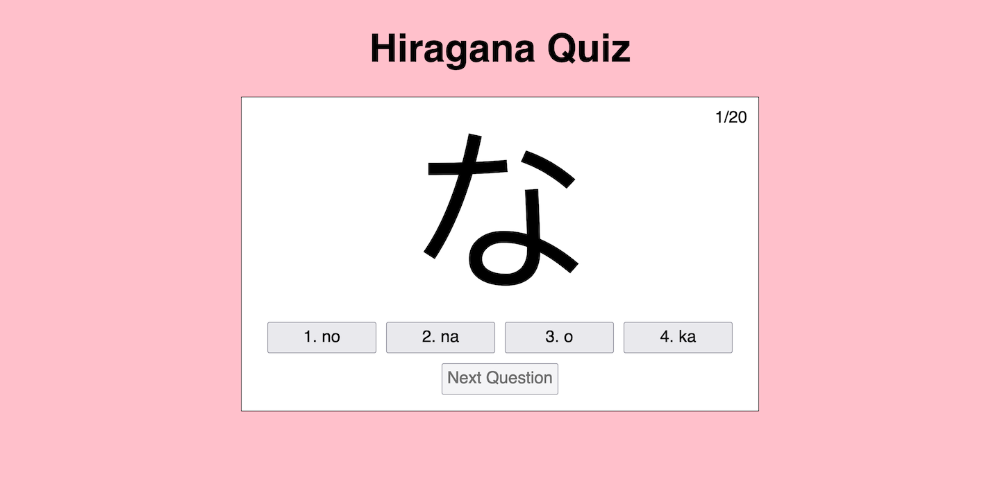

# Hiragana Quiz

## Description

This project is a web-based, multiple-choice quiz intended to help users memorize the Japanese hiragana characters. Users are shown a hiragana character and are asked to select the correct romanization for the character out of four choices. A score is given based on the number of questions correctly answered.

This project was written in HTML, CSS, and JavaScript. `index.html` contains the HTML for the webpage that displays the quiz. `style.css` contains the CSS that styles the page. `script.js` contains most of the JavaScript that makes the page function. `kana.js` contains a list of all the hiragana characters and their romanizations, which are then used in `script.js`.

In completing this project, I was able to further practice using web technologies, and I also started learning to read hiragana!

## Installation

N/A

## Usage

To view the page, navigate to https://spencersurface.github.io/hiragana-quiz in your web browser.

To start the quiz, click on the "Start Quiz" button. For each question in the quiz, decide what you think the correct romanization of the displayed hiragana character is, then click on the buttons with the romanizations to input your answer. Once you have answered a question, click on the "Next Question" button to continue. Once you have completed the quiz, you can click on the "Go Back" button to return to the starting screen.

Here is a screenshot demonstrating how a quiz question should appear before an answer is selected: 

## Credits

All of the code in this project was written by myself.

## License

This project is licensed under the GNU General Public License version 3. See [LICENSE](./LICENSE) for more information.